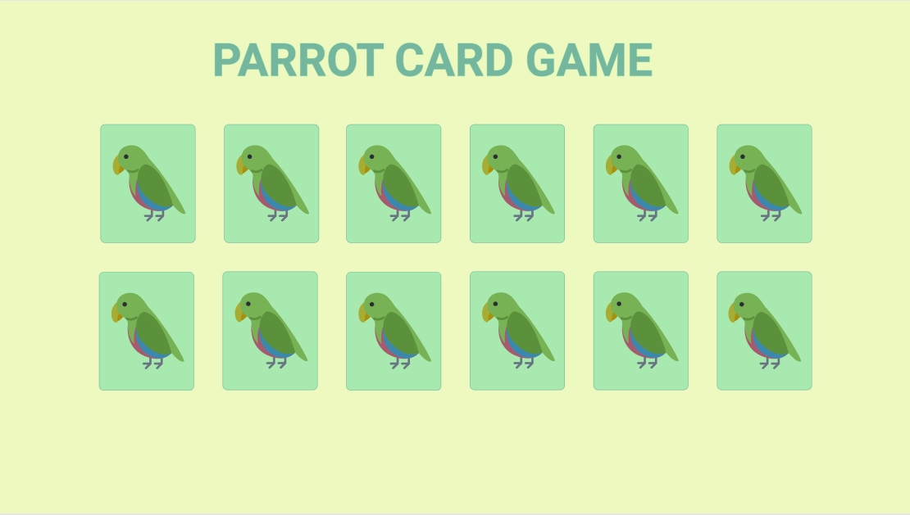

# Parrot Card Game

# Descrição

Seu novo projeto será criar um jogo da memória, com aleatoridade, efeitos e transição, responsividade e papagaios dançantes!

# Requisitos

- Layout
    - [ ]  Aplicar layout responsivo, sem distinção clara entre layout desktop e mobile. Preservando o tamanho de cada carta e posicionando-as de acordo com o espaço horizontal disponível.

    

    

    - [ ]  Você pode usar imagens que desejar para construir as cartas ao longo do jogo e deixar o jogo da cara que preferir. Evite usar imagens muito parecidas para não confundir a galera, beleza?
    - [ ]  Um contador de tempo para o jogo aparece no canto superior direito.
    - [ ]  Um contador de jogadas aparece no canto superior esquerdo.
    - [ ]  Usar fonte Roboto para título.

- Jogo
    - [ ]  O jogo é constituído de 12 cartas, com 6 pares de cartas idênticas dois a dois.
    - [ ]  O jogo sempre inicia com todas as cartas viradas para baixo, mostrando uma superfície em comum entre elas.
    - [ ]  As cartas devem estar sempre em posições aleatórias a cada inicialização do jogo.
    - [ ]  Quando o jogador clica na carta, uma animação correta e carta é virada, mostrando seu verso.
    - [ ]  O jogador pode então clicar em outra carta, se ele clicar em outra carta igual, as duas ficam viradas até o final do jogo, caso contrário, as duas são viradas novamente após 1 segundo. Neste período, nenhuma outra carta pode ser virada.
    - [ ]  O jogador tem XXmin para terminar o jogo, num contador marcado no topo. Após esse tempo, o jogo reinicia.
    - [ ]  Quando o jogador ganha o jogo, uma mensagem de vitória aparece na tela. É festa.